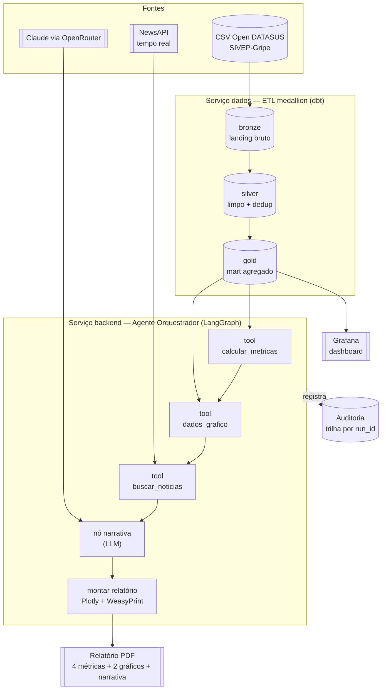

# Desafio GenAI — Relatório Automatizado de SRAG


PoC de um **agente de IA generativa** (LangGraph) que consulta **dados reais de SRAG**
(Open DATASUS / SIVEP-Gripe) e **notícias em tempo real** para gerar um **relatório
automatizado** em PDF, com as métricas exigidas, dois gráficos e uma narrativa de contexto
— tudo rodando em **Docker**.

> Contexto: PoC para a Indicium HealthCare Inc. avaliar uma solução que ajude profissionais
> de saúde a entender a severidade e o avanço de surtos de SRAG.

---

## Arquitetura

**Princípio-guia:** *o LLM orquestra e explica; o Python calcula* — todas as métricas são
SQL/Python determinístico; o LLM só narra sobre números já calculados (sem alucinar).
Núcleo **hexagonal** (Ports & Adapters), dados em **arquitetura medallion** (bronze → silver
→ gold), tudo containerizado.

### Diagrama conceitual



> Versão em **PDF** (entregável): [`docs/diagrama-conceitual.pdf`](docs/diagrama-conceitual.pdf)
> — reproduzível via `uv run --with weasyprint python docs/gerar_diagrama.py`.

- **Camadas de código** (`backend`): `domain/` (puro, sem I/O) → `application/` (casos de uso
  + orquestração LangGraph + guardrails) → `infrastructure/` (adapters: Postgres, NewsAPI,
  OpenRouter, relatório) + `observability/`, `api/`, `cli.py` (composition root).
- As fronteiras do hexágono são **impostas no CI** via `import-linter`.
- Detalhes: [`vault/arquitetura.md`](vault/arquitetura.md) · decisões em
  [`vault/decisoes/`](vault/decisoes) (ADRs 0001–0015).

### Serviços (Docker)

| Serviço | Papel |
|---|---|
| `postgres` | store analítico servido (camada gold) |
| `dados` | job de ETL medallion: EL (Python → bronze) + **dbt** (staging→intermediate→marts, **star schema**) com testes de dados |
| `backend` | FastAPI + agente LangGraph + tools + geração do PDF |
| `grafana` | dashboard interativo (lê a gold) |

---

## Como rodar

Pré-requisito: **Docker** (com integração WSL2 ativa, se aplicável).

```bash
cp .env.example .env      # preencha OPENROUTER_API_KEY e NEWSAPI_KEY
# coloque os CSVs do DATASUS em data/raw/srag/  (ver data/README.md)

docker compose up -d postgres backend grafana      # sobe a stack
docker compose --profile etl run --rm dados        # roda o ETL (carrega bronze→silver→gold)
```

- **Hub / demo:** http://localhost:8000/ — ponto de entrada único (métricas ao vivo, gerar
  relatório PDF, última execução do agente + fontes, e links para tudo)
- **API:** docs interativas em http://localhost:8000/docs
- **Grafana:** http://localhost:3000 · usuário `admin`, senha em `GF_SECURITY_ADMIN_PASSWORD` (`.env`) · dashboard *"SRAG — Visão Geral"*

### Endpoints

| Endpoint | O que faz |
|---|---|
| `GET /health`, `/health/db` | liveness / readiness |
| `GET /metricas` | as 4 métricas (JSON) |
| `POST /relatorio` | gera o **relatório PDF** completo |
| `GET /agente/grafo` | o grafo do agente em **Mermaid** (visualização do fluxo) |

---

## As métricas e os gráficos

| Métrica | Definição | Fonte |
|---|---|---|
| Taxa de aumento de casos | variação % vs. período anterior de igual duração | `DT_SIN_PRI` |
| Taxa de mortalidade | óbitos (`EVOLUCAO=2`) / casos com desfecho conhecido | `EVOLUCAO` |
| Taxa de ocupação de UTI | **proxy:** casos com `UTI=1` / casos com UTI conhecida | `UTI` |
| Taxa de vacinação | **proxy:** casos vacinados / casos com status conhecido | `VACINA_COV` |

UTI e vacinação são **proxies explícitos** (a base traz status por caso, não leitos totais nem
cobertura populacional) — a premissa é documentada no relatório. Os denominadores usam apenas
valores conhecidos (1/2). **Gráficos:** casos diários (30 dias) e mensais (12 meses).

---

## Governança, guardrails e dados sensíveis

- **Governança/transparência:** cada execução gera um `run_id` e uma **trilha de auditoria**
  (nós, tipos, tempos) persistida no Postgres e visível no Grafana; o relatório traz rodapé
  com modelo, fontes e timestamp. As **ADRs** registram o *porquê* de cada decisão.
- **Guardrails:** validação de entrada (pydantic), **grounding** (o LLM só narra sobre números
  das tools), filtro de relevância de notícias, validação de saída e falha explícita/`N/A`.
- **Dados sensíveis (LGPD):** minimização (só ~6 colunas carregadas), **só agregados são
  servidos** (camada gold); microdados não saem do banco a nível de indivíduo.
- **Resiliência:** timeouts, retry com backoff, degradação graciosa (o relatório sai mesmo sem
  notícias ou com o LLM indisponível, via fallback determinístico).

---

## Qualidade

- **`ruff`** (lint/format) + **`mypy --strict`** + **`import-linter`** (fronteiras do hexágono)
- **`pytest`** com **cobertura ≥ 85%** (atual ~99%) e casos de borda
- **`bandit`** (segurança)
- **GitHub Actions** roda todos os portões em cada push

```bash
cd backend && uv run --extra dev pytest        # testes + cobertura
uv run --extra dev ruff check . && uv run --extra dev mypy src
uv run --extra dev lint-imports && uv run --extra dev bandit -r src -q
```

### SonarQube (dashboard de qualidade, em Docker)

Serviço opcional (profile `quality`) — dashboard com cobertura, bugs, vulnerabilidades,
security hotspots, code smells e duplicação.

```bash
docker compose --profile quality up -d sonar-db sonarqube   # http://localhost:9000 (admin/admin)
# no SonarQube: crie um token e exporte-o
cd backend && uv run --extra dev pytest                     # gera coverage.xml
SONAR_TOKEN=<seu-token> docker compose --profile quality run --rm sonar-scanner
```

Última análise: **cobertura 99,4% · 0 bugs · 0 vulnerabilidades · 0 hotspots · 0% duplicação**.
Os adapters de I/O ficam fora da métrica de cobertura (testados por integração).

---

## Stack

Python · Docker · **Postgres** · **dbt** (medallion) · **FastAPI** · **LangGraph** ·
**Claude via OpenRouter** · **NewsAPI** · **Plotly + WeasyPrint** (PDF) · **Grafana** ·
`structlog` · `tenacity` · **uv/ruff/mypy/pytest**. Tracing de LLM opcional via **OpenRouter
Broadcast → LangSmith** (config no painel do OpenRouter, sem código).

## Documentação

O diretório [`vault/`](vault/README.md) é a documentação viva do projeto: arquitetura,
domínio, ADRs e roadmap. Dados em [`data/README.md`](data/README.md).
