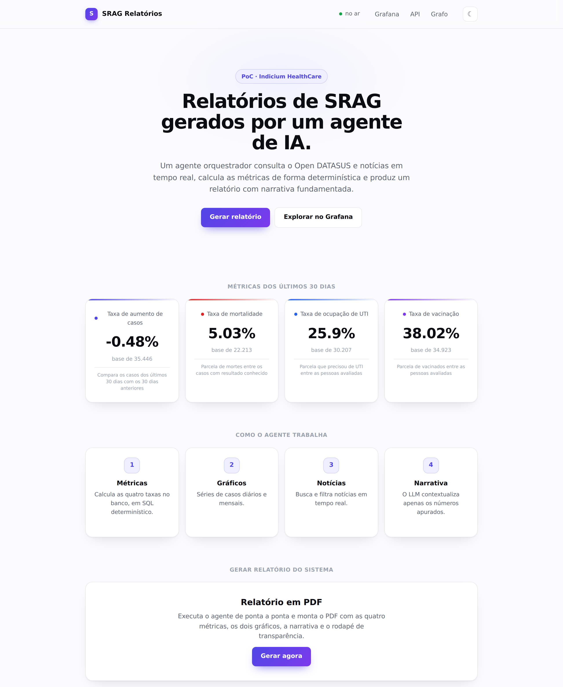
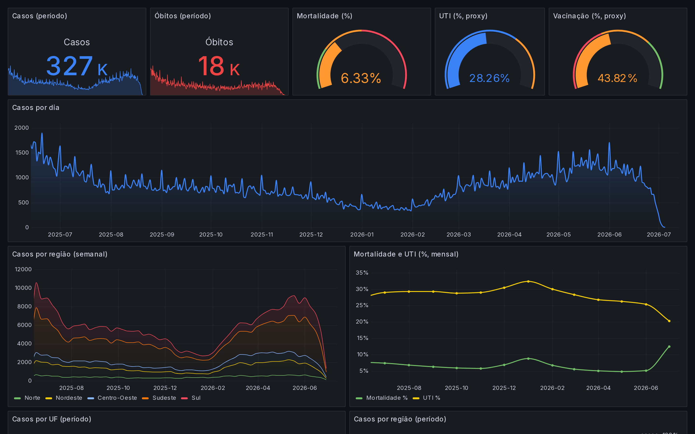
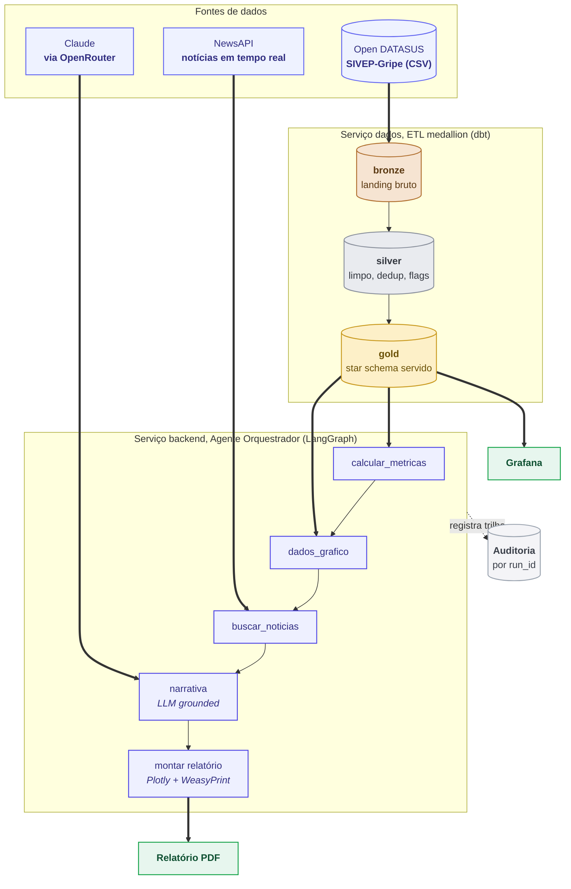
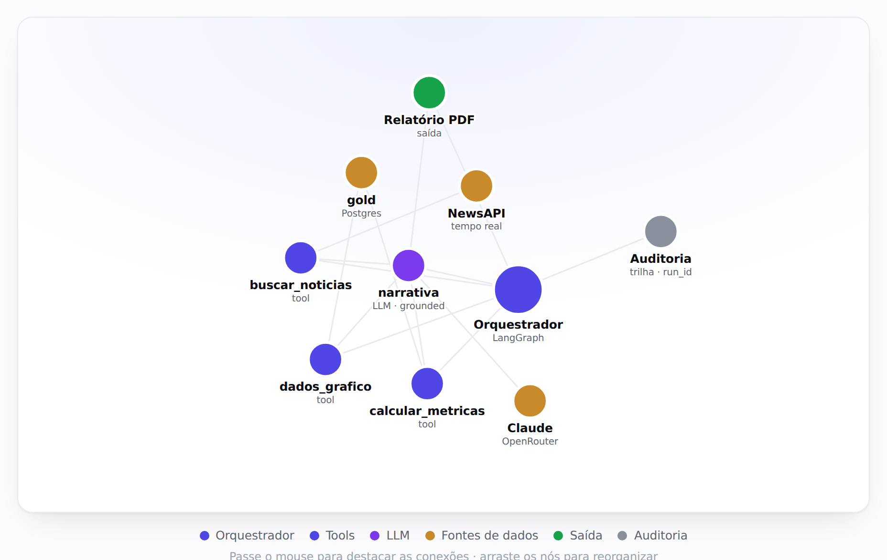
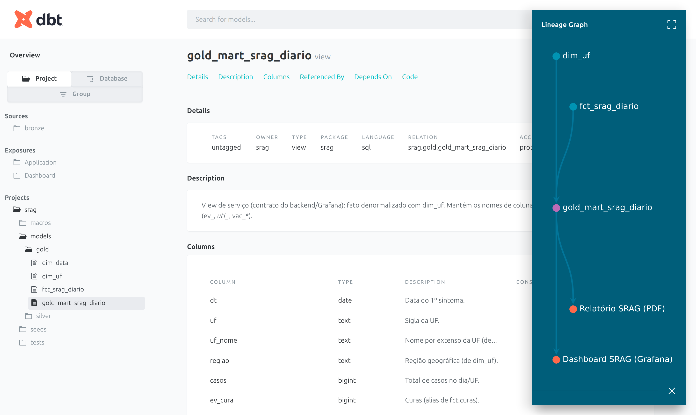
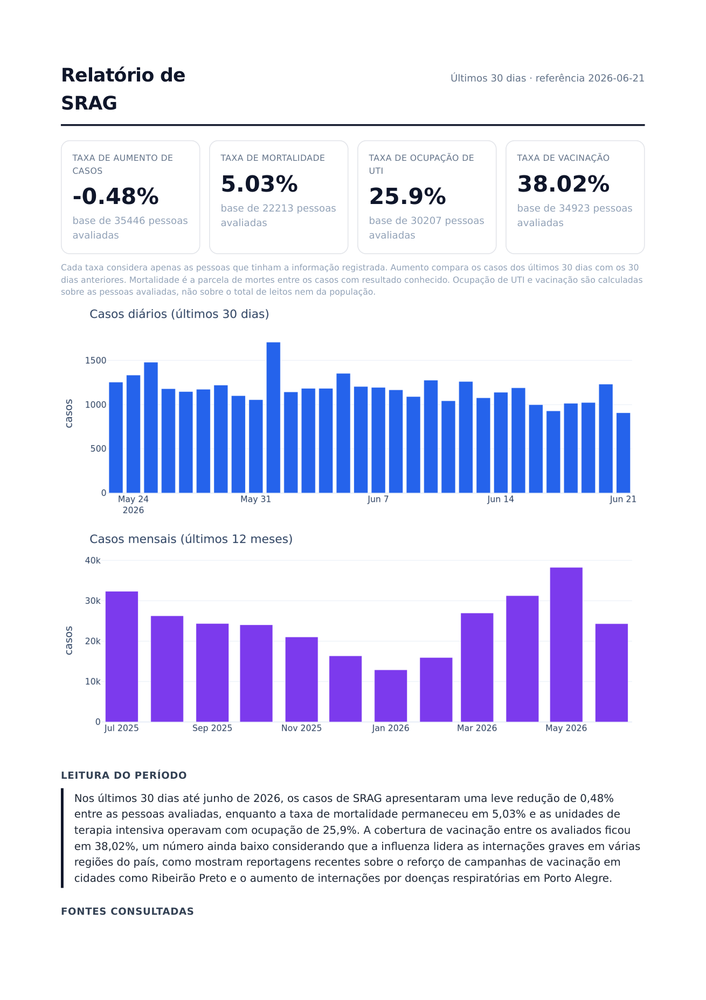
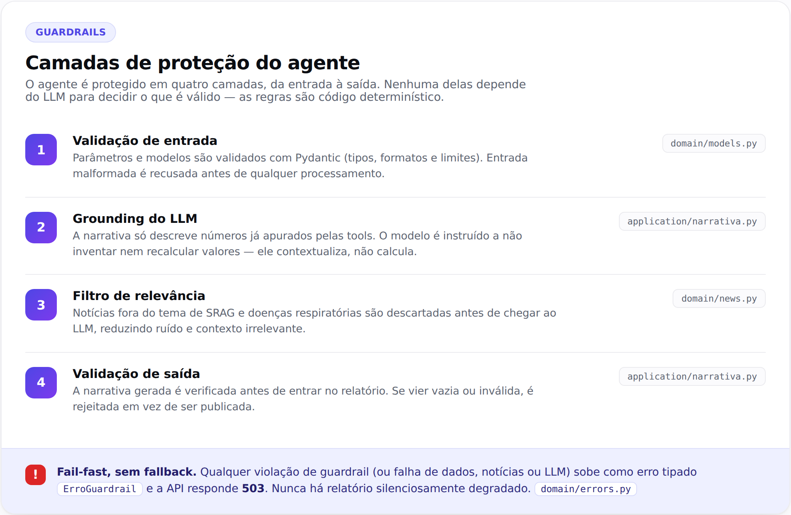
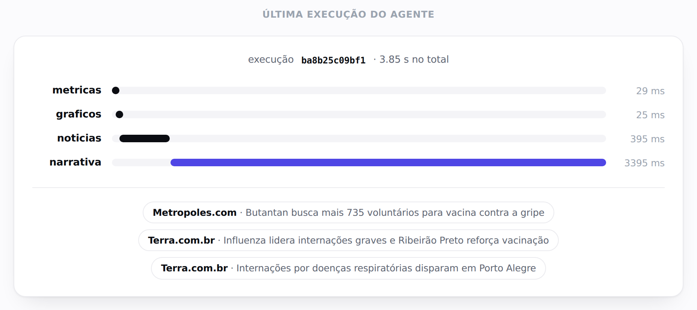
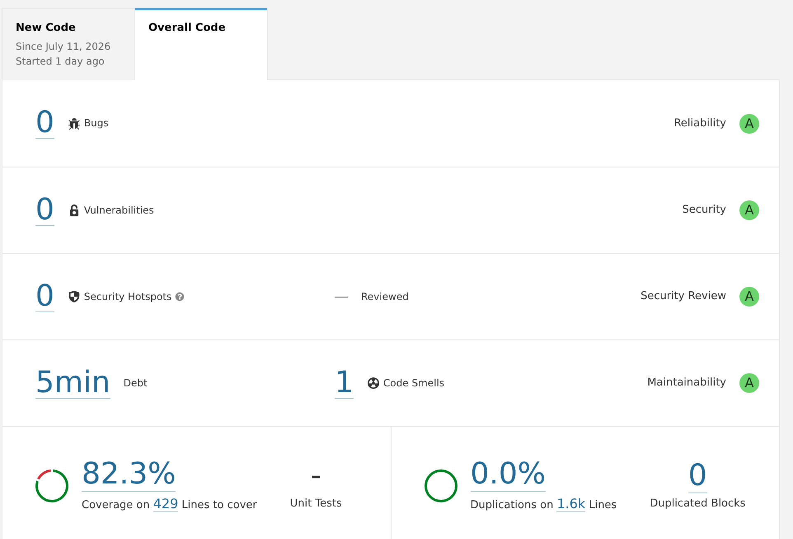

# Desafio GenAI · Relatório Automatizado de SRAG


Agente de IA generativa (LangGraph) que consulta dados reais de SRAG (Open DATASUS / SIVEP-Gripe)
e notícias em tempo real para gerar um relatório automatizado em PDF, com as métricas exigidas,
dois gráficos e uma narrativa de contexto. Toda a solução roda em Docker.

Contexto: PoC para a Indicium HealthCare Inc. avaliar uma solução que ajude profissionais de
saúde a entender a severidade e o avanço de surtos de SRAG.

<p align="center">
  
  <br><sub><b>Hub</b> em <code>localhost:8000</code> — métricas ao vivo, geração do relatório em tempo real e explorador de notícias (tema claro por padrão, com alternância para escuro).</sub>
</p>

## Sumário

1. [Cobertura dos requisitos](#cobertura-dos-requisitos)
2. [Como rodar](#como-rodar)
3. [Interfaces](#interfaces)
4. [Arquitetura](#arquitetura)
5. [Métricas e gráficos](#métricas-e-gráficos)
6. [Governança, guardrails e dados sensíveis](#governança-guardrails-e-dados-sensíveis)
7. [Qualidade](#qualidade)
8. [Stack e documentação](#stack-e-documentação)

## Cobertura dos requisitos

Onde cada exigência e critério de avaliação está no projeto — código, tela ao vivo e o print
correspondente neste README.

| Requisito / critério | Onde está | Print |
|---|---|---|
| Integração Open DATASUS | ETL `dados/src/srag_etl/` → camada `bronze/`; baixa o CSV real do SIVEP-Gripe | [dbt docs](#arquitetura) |
| Arquitetura · Agente Orquestrador | `backend/src/srag_report/application/orchestration/` (LangGraph); [grafo ao vivo](http://localhost:8000/agente/grafo) | [diagrama](#arquitetura) · [grafo](#arquitetura) |
| Uso de Tools | `application/tools.py` — `calcular_metricas`, `dados_grafico`, `buscar_noticias` | [grafo](#arquitetura) |
| Métricas (as 4) | `domain/metrics.py`; [`/metricas`](http://localhost:8000/metricas) | [relatório](#métricas-e-gráficos) · [hub](#desafio-genai--relatório-automatizado-de-srag) |
| Gráficos (30d e 12m) | `infrastructure/report/charts.py` | [relatório](#métricas-e-gráficos) |
| Guardrails | `narrativa.py`, `domain/news.py`, `domain/models.py`, `domain/errors.py` | [diagrama](#governança-guardrails-e-dados-sensíveis) |
| Governança e transparência | `infrastructure/audit/`; [`/auditoria/execucoes`](http://localhost:8000/auditoria/execucoes) | [trilha](#governança-guardrails-e-dados-sensíveis) |
| Tratamento de dados sensíveis | minimização no `bronze`; só a `gold` agregada é servida | — |
| Clean Code | `ruff` · `mypy --strict` · `bandit` · `import-linter` · CI · SonarQube | [SonarQube](#qualidade) |
| Documentação (processo de dados) | `dbt docs` gerado dos `.yml` em `bronze/silver/gold/` | [dbt docs](#arquitetura) |

## Como rodar

Pré-requisitos: **Docker** (com integração WSL2 ativa, se aplicável) e as chaves de API do
**OpenRouter** (LLM) e do **NewsAPI** (notícias).

```bash
# 1. Configuração (o .env é gitignored; nenhuma chave vai para o repositório)
cp .env.example .env
#    preencha OPENROUTER_API_KEY e NEWSAPI_KEY no .env

# 2. Suba a stack (Postgres, backend/agente, Grafana)
docker compose up -d postgres backend grafana

# 3. Rode o ETL (bronze -> silver -> gold + testes de dados)
docker compose --profile etl run --rm dados
```

No passo 3, se não houver CSV em `data/raw/srag/`, o ETL **baixa os dados automaticamente** do
Open DATASUS (S3 público, snapshot versionado). Ou seja, o projeto roda a partir de um clone
limpo, sem precisar do arquivo de 554 MB no repositório.

Em seguida, abra o **hub** em **http://localhost:8000/**.

## Interfaces

| Interface | URL | Descrição |
|---|---|---|
| Hub | http://localhost:8000/ | Ponto de entrada: métricas ao vivo, geração de relatório em tempo real, trilha da última execução e explorador de notícias (histograma por mês, filtros por fonte e período) |
| API (Swagger) | http://localhost:8000/docs | Documentação interativa dos endpoints |
| Grafana | http://localhost:3000 | Dashboard interativo (usuário `admin`, senha em `GF_SECURITY_ADMIN_PASSWORD`) |

Endpoints principais:

| Endpoint | Função |
|---|---|
| `POST /relatorio` | Gera o relatório PDF completo (bloqueante) |
| `GET /relatorio/stream` | Gera o relatório emitindo o progresso do agente nó a nó (SSE) |
| `GET /metricas` | As quatro métricas em JSON |
| `GET /noticias` | Histórico de notícias, filtrável por `fonte` e `dias` (período) |
| `GET /noticias/serie` e `/noticias/fontes` | Volume mensal e fontes distintas do histórico |
| `POST /noticias/buscar` | Coleta notícias (10 consultas) e persiste no histórico; retorna quantas são novas |
| `GET /agente/grafo` | Página do fluxo do agente (fonte Mermaid em `?format=mermaid`) |
| `GET /auditoria/execucoes` e `/{run_id}` | Execuções do agente e a trilha detalhada (tempos, fontes) |
| `GET /health`, `/health/db` | Liveness e readiness |

<p align="center">
  
  <br><sub><b>Grafana</b> em <code>localhost:3000</code> — dashboard interativo provisionado como código, lendo a camada gold.</sub>
</p>

## Arquitetura

Princípio-guia: o LLM orquestra e explica, o Python calcula. Todas as métricas são SQL/Python
determinístico; o LLM apenas narra sobre números já apurados, sem alucinar. O núcleo do backend
segue **hexagonal (Ports & Adapters)** e os dados seguem **medallion** (bronze, silver, gold).



Versão em PDF (entregável): [`docs/diagrama-conceitual.pdf`](docs/diagrama-conceitual.pdf),
reproduzível com `uv run --with weasyprint python docs/gerar_diagrama.py`.

<p align="center">
  
  <br><sub><b>Grafo do agente</b> em <code>localhost:8000/agente/grafo</code> — visualização interativa (arraste os nós; o hover destaca as conexões) do orquestrador, das tools, do LLM e das fontes.</sub>
</p>

Camadas de código do `backend`: `domain/` (puro, sem I/O), `application/` (casos de uso,
orquestração LangGraph e guardrails), `infrastructure/` (adapters de Postgres, NewsAPI,
OpenRouter e relatório), além de `api/` e `composition.py` (composition root). As fronteiras do
hexágono são impostas no CI pelo `import-linter`. Detalhes em
[`vault/arquitetura.md`](vault/arquitetura.md) e nas ADRs em [`vault/decisoes/`](vault/decisoes).

Serviços em Docker:

| Serviço | Papel |
|---|---|
| `postgres` | Store analítico servido (camada gold) |
| `dados` | Job de ETL: EL em Python (bronze) e **dbt** — uma pasta por camada (`bronze/`, `silver/`, `gold/`), star schema na gold, com testes de dados |
| `backend` | FastAPI, agente LangGraph, tools e geração do PDF |
| `grafana` | Dashboard interativo (lê a gold) |

### Documentação do ETL (dbt docs)

Cada model das camadas `bronze/`, `silver/` e `gold/` é documentado nos próprios arquivos
`.yml` (descrição de tabelas e colunas, testes), e esses docs viram comentários no Postgres
(`persist_docs`). O dbt gera um site navegável com **lineage** a partir daí — via Docker
(recomendado) ou local:

```bash
# Docker: sobe o site em http://localhost:8080 (porta configurável em DBT_DOCS_PORT)
docker compose --profile docs up -d dbt-docs

# ou local
cd dados/dbt && dbt docs generate && dbt docs serve   # http://localhost:8080
```

Os `README.md` de cada pasta (`models/bronze|silver|gold/`) são **gerados** a partir do
`manifest.json`/`catalog.json` do dbt (não editados à mão) por
[`dados/dbt/scripts/gerar_readmes.py`](dados/dbt/scripts/gerar_readmes.py) — assim ficam sempre
em sincronia com os `.yml`.

<p align="center">
  
  <br><sub><b>dbt docs</b> — documentação automática das camadas (descrições, colunas, testes) e o <i>lineage</i> completo, do dado bruto até o relatório e o dashboard (via <code>exposures</code>).</sub>
</p>

## Métricas e gráficos

| Métrica | Definição | Coluna |
|---|---|---|
| Taxa de aumento de casos | Variação percentual vs. período anterior de igual duração | `DT_SIN_PRI` |
| Taxa de mortalidade | Óbitos (`EVOLUCAO=2`) sobre casos com desfecho conhecido | `EVOLUCAO` |
| Taxa de ocupação de UTI | Proxy: casos com `UTI=1` sobre casos com UTI conhecida | `UTI` |
| Taxa de vacinação | Proxy: casos vacinados sobre casos com status conhecido | `VACINA_COV` |

UTI e vacinação são proxies explícitos, pois a base traz status por caso, não leitos totais nem
cobertura populacional. A premissa é documentada no relatório e os denominadores usam apenas
valores conhecidos (1 ou 2). Gráficos: casos diários (30 dias) e casos mensais (12 meses).

**Dicionário de dados** em [`docs/dicionario-de-dados.md`](docs/dicionario-de-dados.md), com os
campos de origem usados, o esquema da camada gold que criamos e o significado da base de cada
métrica. Fonte oficial [Open DATASUS / SIVEP-Gripe](https://opendatasus.saude.gov.br), com
dicionário e ficha em [`data/reference/`](data/reference).

<p align="center">
  
  <br><sub><b>Relatório PDF</b> gerado pelo agente — as quatro métricas, os dois gráficos, a narrativa fundamentada e as fontes consultadas.</sub>
</p>

## Governança, guardrails e dados sensíveis

- **Governança e transparência:** cada execução recebe um `run_id` e grava uma trilha de
  auditoria (nós, tipos, durações, métricas e fontes) no Postgres, visível no hub e no Grafana.
  O relatório traz rodapé com modelo, fontes e timestamp. As ADRs registram o porquê de cada decisão.
- **Guardrails:** validação de entrada com pydantic, grounding (o LLM só narra sobre os números
  das tools), filtro de relevância das notícias, validação de saída e falha explícita ou `N/A`.
- **Dados sensíveis (LGPD):** minimização (só as colunas necessárias entram no bronze) e apenas
  agregados são servidos (camada gold); nenhum dado a nível de indivíduo sai do banco.
- **Resiliência (fail-fast, sem fallback):** timeouts e retry com backoff em erros transitórios;
  esgotados os retries, a falha sobe como erro tipado e a API responde **503** (ou emite evento
  de erro no stream). Não há relatório silenciosamente degradado: se dados, notícias ou LLM
  falharem, a execução falha explicitamente, em vez de entregar um relatório que aparente estar
  completo. Ver [`adr-0010`](vault/decisoes/adr-0010-resiliencia.md).

<p align="center">
  
  <br><sub><b>Guardrails</b> — quatro camadas determinísticas (da entrada à saída) mais o fail-fast: qualquer violação vira erro tipado, sem relatório degradado.</sub>
</p>

<p align="center">
  
  <br><sub><b>Trilha de auditoria</b> (no hub) — cada execução tem <code>run_id</code>, o tempo de cada nó do agente e as fontes usadas; registro de decisões para governança.</sub>
</p>

## Qualidade

Portões automatizados, executados no CI a cada push:

- `ruff` (lint e formatação), `mypy --strict` (tipagem) e `import-linter` (fronteiras do hexágono)
- `pytest` com cobertura mínima de 85% (atual 100%) e casos de borda
- `bandit` (segurança) e `sqlfluff` (lint de SQL do dbt)

```bash
cd backend && uv run --extra dev pytest
uv run --extra dev ruff check . && uv run --extra dev mypy src
uv run --extra dev lint-imports && uv run --extra dev bandit -r src -q
```

**SonarQube** (dashboard de qualidade, profile `quality`; sobe sob demanda, não fica rodando):

```bash
docker compose --profile quality up -d sonar-db sonarqube   # http://localhost:9000
cd backend && uv run --extra dev pytest                     # gera coverage.xml
SONAR_TOKEN=<token> docker compose --profile quality run --rm sonar-scanner
```

<p align="center">
  
  <br><sub><b>SonarQube</b> em <code>localhost:9000</code> — Quality Gate <b>Passed</b>: 0 bugs, 0 vulnerabilidades, 0 hotspots, ratings A, <b>100% de cobertura</b> e 0% de duplicação.</sub>
</p>

Última análise: cobertura 99,4%, 0 bugs, 0 vulnerabilidades, 0 hotspots, 0% duplicação. Os
adapters de I/O ficam fora da métrica de cobertura (são cobertos por testes de integração).

## Stack e documentação

Python, Docker, Postgres, dbt (medallion), FastAPI, LangGraph, Claude via OpenRouter, NewsAPI,
Plotly, WeasyPrint, Grafana, `structlog`, `tenacity`, e `uv`/`ruff`/`mypy`/`pytest`. Tracing de
LLM opcional via OpenRouter Broadcast para o LangSmith (configurado no painel do OpenRouter).

Documentação viva em [`vault/`](vault/README.md) (arquitetura, domínio, ADRs, princípios SOLID).
Dados em [`data/README.md`](data/README.md) e ETL em [`dados/README.md`](dados/README.md).
